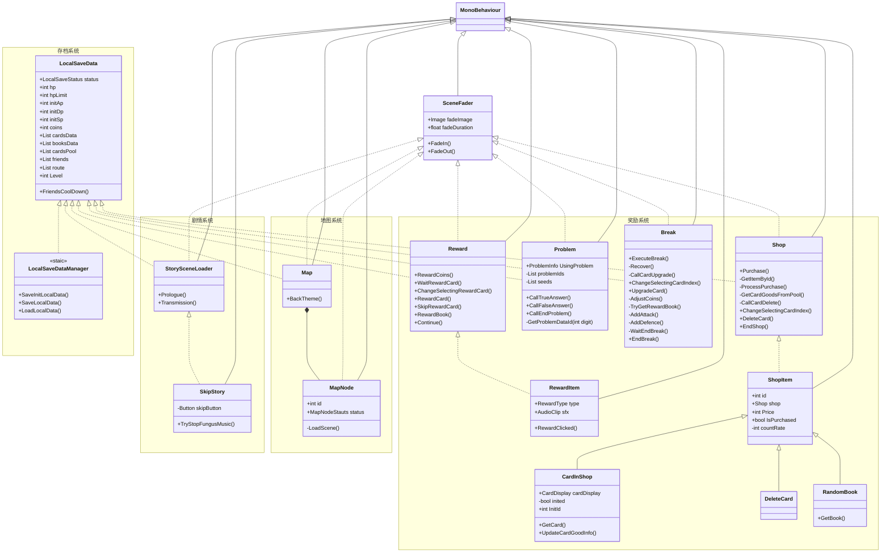
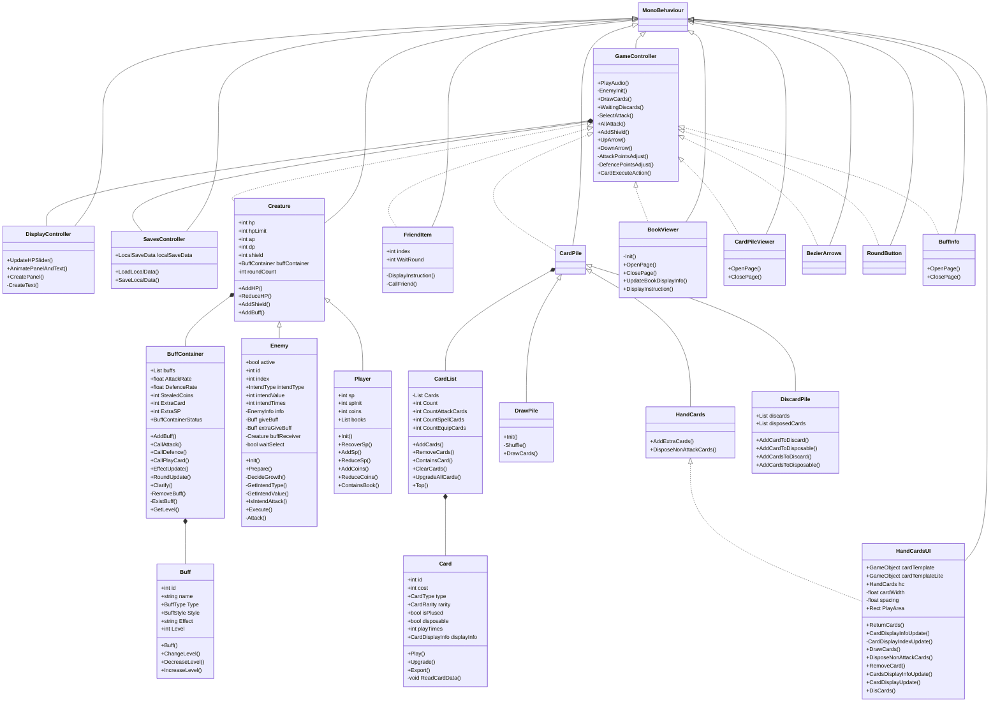

# “缉古算今”游戏项目设计说明书
缉古算今(Stagnated Epoch:Legacy of Chinese Mathematics)

## 1. 简介

### 1.1 项目背景及作品创意

【介绍本作品的创意来源，产生背景，作品的主要功能，成果的应用目标，项目资助等。】

### 1.2 项目实施计划

【阶段性描述】

## 2. 多媒体系统整体设计

### 2.1 作品功能

该作品同时兼具关于《九章算术》内容的教育功能和基于闯关游戏的娱乐功能，作品结尾也将通过相应的设计引发用户关于当下科技时代如何对待传统经典智慧的反思，最后达到创新性继承和弘扬中华优秀传统文化，树立文化自信，挣脱科技“茧房”的功能效果。

#### 2.1.1 功能概述

本作品所实现的主要系统功能包括：地图系统、剧情系统、战斗系统、奖励系统、存档系统和图鉴系统。系统框架如下图所示：

图中黑色实线代表的是作品各个系统功能之间的从属关系；灰色虚线箭头代表的是游戏数据在各个系统功能之间的流向。每个主要系统实现的功能概述如下：

- 地图系统：串联起游戏各个系统的重要组成部分；
- 剧情系统：总计包含51段剧情（总时长约2-3小时），在推进主线剧情的同时向玩家传授各种与中国古代数学相关的知识，并且设置了可交互部分，以达到寓教于乐的效果；
- 战斗系统：和主线剧情相关联，使用代表数学知识的卡牌战胜敌人，赢取丰厚的奖励；
- 奖励系统：结算游戏中获得各种属性增益或者资源奖励；
- 存档系统：存储游戏状态到本地，以备之后再次读取调用；
- 图鉴系统：可以查询与游戏相关的各项信息，同时也包含了一些关于中国古代数学知识的介绍；

#### 2.1.2 功能说明

由于图鉴系统主要起到查询游戏相关信息的功能，因此将穿插在其他系统功能说明中一并介绍，不再作单独说明；存档系统并非玩家可以直接交互的功能，因此在此章节也暂不展开介绍。

##### 地图系统

本作品尽可能按照肉鸽类（Roguelike）游戏的设计模式进行设计，因此地图系统具有生成随机性、进程单向性、不可挽回性、游戏非线性等特点。玩家能够交互的地图界面如下图所示：

整张地图之间的路径均单向连接。玩家可以在一些节点自由选择进入哪条分支，但是不能走回头路。在地图中玩家已经通过的节点会被标记为红色，当前可以到达的节点标记为绿色，剩余不能到达的节点标记为灰色。一旦玩家在探险过程中死亡（体力值为0），只能从头开始探险。地图中可供玩家选择的地图节点类型说明如下：

- 剧情节点：玩家在剧情中与NPC互动学习数学知识，在剧情系统章节将会继续展开介绍；
- 战斗节点（包含敌人、精英、Boss）：玩家与遭遇到的各种敌人进行战斗并且获得奖励，在战斗系统章节将会继续展开介绍；
- 客栈节点：玩家可以在这里进入客栈，选择回复在战斗中失去的体力值、升级卡牌、获得银币或典籍、获得属性提升等效果；
- 商铺节点：玩家可以在这里使用获得的银币购买卡牌和典籍（有关典籍将会在典籍系统章节介绍），也可以在商铺用银币回收不需要的卡牌；
- 宝箱节点：玩家可以直接从宝箱节点获取银币和典籍奖励；
- 未知节点：玩家将会在这些节点遇到一些中国古代数学的谜题。如果回答正确，将会获得一种随机的正面增益；如果回答错误，同样会随机获得一种负面效果；

##### 剧情系统

玩家在剧情中与九章世界的原住民相识、互动、答题。不断学习和精进数学知识，解锁新的卡牌加入到卡池，并且获得各种奖励。玩家将会在剧情中逐渐结识九位原住民友人，她们将会在战斗中提供强大的助战效果。以下是玩家可以交互的剧情运行界面，包含了正常的文本对话模式和答题交互模式：

##### 战斗系统

在具体介绍战斗系统的功能及交互流程之前，需要先介绍其中几个重要的组成子系统：

**卡牌系统**

在游戏中，玩家获得的魔法能力以卡牌的形式体现。卡牌通过在剧情中与NPC互动学习数学知识被解锁并加入到卡池中，每当玩家获得卡牌奖励时，将会从卡牌池中随机选出默认三张不同卡牌供玩家选择一张加入到牌库中。卡牌可以用于在九章世界中和各类敌人进行战斗。卡牌奖励通常会在每场战斗结束后获得，剧情中也有可能会获得卡牌奖励。游戏中实装的不同卡牌数量为89张。

每一张卡面分别由以下几个部分组成（可参考示意图）：

- 卡牌名称：一张卡牌的标识名称，和中国古代数学相关。
- 卡牌效果：这张牌在战斗时被打出时的效果。在探险过程中玩家可以升级卡牌，从而获得更加强大的效果。
- 卡牌消耗：在战斗中玩家打出手牌需要消耗算术值（会在后文再介绍）。有些卡牌可以通过升级降低所需要消耗的算术值。
- 卡牌原文：与这张卡牌相关的典籍原文。（在图鉴页面，单击卡面上的原文可以触发全屏预览，方便玩家在游戏之余可以了解到卡牌的出处）。
- 卡牌类型：目前阶段已经实装的卡牌类型有三种：攻击牌、锦囊牌、装备牌。攻击牌（红色卡面）主要用于对敌人造成伤害。锦囊牌（蓝色卡面）主要在战斗中实现诸如增加护盾、额外摸牌弃牌等操作。装备牌（绿色卡面）可以给予玩家一些永久的数值增益或者能力。

**典籍系统**

典籍是“九章”世界的文化瑰宝。每一本典籍都可以在探险和战斗中提供强大的增益效果。典籍的获得方式主要依靠地图中的宝箱节点来获得。在与敌人战斗结束后也有概率掉落典籍。在击败每一层的boss后必定掉落该层地图对应的九章算术残卷。集齐九章残卷后可以合成典籍九章算术。游戏中实装的不同典籍数量为35本。

**战斗界面与流程**

整个战斗界面如上图所示，界面上各个组成元素分别为：

- 顶部HUD：可以查看玩家当前的体力值、银币、获得的典籍、当前回合数等信息。也可以召唤友人进行助战（初始只有一名友人，随着主线剧情的推进会逐步解锁至9人，每使用1次友人助战，5次战斗后才能再次使用该友人进行助战）。
- 玩家与敌人信息：可以查看玩家与敌人的体力值、护盾值、基础攻击（防御）力、攻击（防御）倍率、增益效果等信息。
- 算术值（左下角绿色龟壳上的左值）与初始算术值（右值）：玩家打出手牌需要消耗一定的算术值。在没有典籍加持下，每回合开始时玩家的算术值均为初始算术值。
- 摸牌堆（左下角黄色牌堆）、手牌（下方正中间）、弃牌堆（右下角蓝色牌堆）、消耗牌堆（右下角灰色数字中）：不同功能的牌堆。手牌堆直接显示并且可以打出，其他牌堆可以单击数字唤起全屏查看界面。
- 回合结束按钮（右下角卷轴）：结束当前回合玩家操作的阶段。

战斗采用回合制，一个回合分为准备阶段-摸牌阶段-玩家阶段-弃牌阶段-敌人阶段-结束阶段共六个阶段：

- 准备阶段：玩家的算术值回复为初始算术值。敌人生成本回合的行动意图（攻击、防御、回血等）并展示在敌人的血条上方。
- 摸牌阶段：从玩家的摸牌堆默认摸出5张牌加入到手牌中。
- 玩家阶段：玩家消耗算术值打出手牌堆中的手牌来造成各种战斗效果，打出的手牌会被移入到弃牌堆中（装备牌和个别有特殊说明的其他手牌移入到消耗牌堆中）。当玩家认为是时候结束回合时，可以点右下角的按键结束回合。由于每次摸牌时摸牌堆剩余卡牌数量不足时会自动将弃牌堆洗牌后重新放入摸牌堆。因此被移入消耗牌堆的卡牌不能在战斗中再被打出。
- 弃牌阶段：玩家剩余的手牌全部移入弃牌堆（个别有特殊说明的手牌移入到消耗堆中）。敌人失去之前获得的剩余护盾。
- 敌人阶段：敌人根据在准备阶段产生的意图进行行动。
- 结束阶段：清空玩家在本回合中的护盾，进入到下一回合。

当存活敌人数量为0时，战斗胜利，进入奖励页面；玩家体力值归零时，游戏失败。

##### 奖励系统

### 2.2 软硬件运行平台

成品最后的编译生成版本为exe文件，仅支持Windows操作系统使用。根据Unity官方文档，使用Version2022.3编译的桌面端软硬件运行平台需求如下：

| 操作系统     | Windows                                       |
| ------------ | --------------------------------------------- |
| 操作系统版本 | Windows 7 (SP1+), Windows 10 and Windows 11   |
| CPU          | x86、x64 架构（支持 SSE2 指令集）。           |
| 图形API      | 兼容 DX10、DX11、DX12。                       |
| 其他要求     | Hardware vendor officially supported drivers. |

额外说明的是，建议使用16:9比例的显示器运行作品，否则在全屏模式下可能会出现画面显示不全的问题（窗口模式则不受影响）。

### 2.3 系统开发平台

#### 2.3.1 素材创作

本作品中主要由作者创作的素材为图片素材。按照创作途径可以如下划分：

- 自主手绘设计：使用Adobe Photoshop CC 2021；
- AI辅助生成：使用OpenAI ChatGPT 4.0 & DALL-E 3；

#### 2.3.2 交互与代码设计

本作品在交互设计中使用的游戏引擎为Unity，版本号为：

- Unity Hub V3.3.1-c7；
- Unity Editor Version2022.3.15f1c1；

本作品在交互设计中使用的代码编辑器/集成开发环境包括：

- Microsoft Visual Studio Code 1.87.0；
- Microsoft Visual Studio 2022 Community 17.9.0；
- JetBrains Rider 2024.1；

本作品在交互设计中使用的版本控制工具为：

- 本地：git version 2.42.0；
- 远程：Github 私有仓库；

#### 2.3.3 开源平台及第三方工具

本作品中主要使用的开源平台及第三方工具均为Unity插件/第三方库，来源为Github或Unity官方插件商铺，均为免费资源。具体如下：

- [Demigiant/dotween(github.com)](https://github.com/Demigiant/dotween)：界面动画视效插件；
- [snozbot/fungus(github.com)](https://github.com/snozbot/fungus)：剧情交互插件；
- [Warrior Free Asset | 2D 角色 | Unity Asset Store](https://assetstore.unity.com/packages/2d/characters/warrior-free-asset-195707)：战斗界面的玩家模型；
- [Monsters_Creatures_Fantasy | 2D 角色 | Unity Asset Store](https://assetstore.unity.com/packages/2d/characters/monsters-creatures-fantasy-167949)：战斗界面的敌人模型；
- [Fantasy Wooden GUI : Free | 2D GUI | Unity Asset Store](https://assetstore.unity.com/packages/2d/gui/fantasy-wooden-gui-free-103811)：GUI界面素材；
- [Pixel Art Icon Pack - RPG | 2D 图标 | Unity Asset Store](https://assetstore.unity.com/packages/2d/gui/icons/pixel-art-icon-pack-rpg-158343)：GUI界面素材；

### 2.4 作品特色

【重点介绍本作品在创意、制作、开发实现、应用等方面的亮点，有特色的功能，团队重点解决的问题等。】

## 3 多媒体系统详细设计

### 3.1 构想（创意）

### 3.2 交互规则

### 3.3 视觉艺术

### 3.4 程序系统设计与编程

#### 3.4.1 功能模块设计

在多媒体系统整体设计章节提到本作品所实现的主要系统功能包括地图系统、剧情系统、战斗系统、奖励系统、存档系统和图鉴系统。接下来将逐个对系统的各个功能模块设计进行介绍：

##### 地图系统、剧情系统、奖励系统与存档系统

这四个系统之间的功能依赖关系较为紧密，因此绘制在同一张模块调用关系图中，如上图所示。（为了避免繁杂，只展示类型中一些主要的类型及方法。下同）下面是对这四个系统中模块的功能介绍：

- `MonoBehavior`：Unity脚本的共同父类。（下同，不再重复介绍）
- `SceneFader`：场景跳转模块。提供方法在加载场景时淡入；或跳转到目标场景时淡出。
- `LocalSaveData`：游戏存档的储存模块，包含了游戏过程中玩家的各项属性、背包资源、解锁地图等数据；同时包含了一些便于对存档数据进行读写操作的方法。大部分系统依赖于该模块来交换和暂存数据。
- `LocalSaveDataManager`：静态模块，提供方法从本地文件读取存档；或将存档保存为本地文件。
- `StorySceneLoader`：提供方法在剧情结束后跳转到下一个目标场景。
- `SkipStory`：提供方法直接快速跳过剧情。
- `Map`：构成地图系统的主要模块。本身具有与存档系统交互的功能，同时提供方法使玩家返回主界面。
- `MapNode`：与Map模块组合，记录每一个地图节点的相关数据，提供方法跳转到该节点对应的场景。
- `Reward`：实现在宝箱节点或剧情/战斗结束之后向玩家提供各种奖励功能的模块，本身具有与存档系统交互的功能。
- `RewardItem`：依赖于Reward模块，调用Reward中的对应方法向存档中写入奖励数据。
- `Problem`：提供方法实现地图中未知节点中答题功能的模块，本身具有与存档系统交互的功能。
- `Break`：提供方法实现地图中客栈节点的模块，本身具有与存档系统交互的功能。
- `Shop`：提供方法实现地图中商铺节点的模块，本身具有与存档系统交互的功能。
- `ShopItem`：依赖于Shop模块，调用Shop中的对应方法从存档中读取剩余银币进行交易，并将结果数据写入到存档中。
- `CardInShop`：继承自ShopItem，主要实现从商铺中购买卡牌的功能。
- `DeleteCard`：继承自ShopItem，主要实现从商铺中回收卡牌的功能。
- `RandomBook`：继承自ShopItem，主要实现从商铺中抽选典籍的功能。

##### 战斗系统

战斗系统的功能模块设计如上图所示，接下来对每个模块的功能进行介绍：

- `GameController`：整个战斗系统的核心控制模块，战斗系统中的基本所有模块都依赖于该模块运行。负责整场战斗中所有底层数据以及游戏进程的控制。
- `DisplayController`：与GameController组合，负责控制整个战斗系统中的用户界面显示内容。
- `SavesController`：与GameController组合，负责控制战斗系统与存档系统之间的数据交互。
- `Creature`：玩家和敌人的共同基类，包括了一些共同的属性（如血量、攻击力、防御力等）和方法。
- `Enemy`：继承自Creature类的敌人模块，除了重载基类部分方法外主要增加了有关回合意图的控制功能。
- `Player`：继承自Creature类的玩家模块，除了重载基类部分方法外主要增加了有关玩家算术值和典籍的相关属性和方法。
- `BuffContainer`：与Creature组合。

### 3.5 美术、声效

### 3.6 编剧、角色、道具、场景

### 3.7 界面设计

## 4. 系统安装及使用说明

解压编译完成的文件压缩包，直接运行`SELOCM/SELOCM.exe`即可。

## 5. 总结

本作品基于对中国古代数学著作《九章世界》的学习与剖析，结合对当下人们过于依赖科技产品的社会现状的反思，积极响应国家关于弘扬中华优秀传统文化的号召，创作了一条古今相交的游戏故事主线；在原创学习剧情的同时，还设计了诸多极具热血冒险风格的游戏情节。

在游戏素材方面，我们通过原创剧情故事、手绘人物形象、AI创作背景图片等方式，力求游戏画面独特美观；在作品可玩性方面，我们通过灵活的后台设置，使其游戏小节随机性大大提高，不同时间的游戏体验均会有所区别；在作品立意方面，我们围绕弘扬中国优秀传统文化、科学使用现代科技产品的主题展开项目，力求“寓教于乐”的功能效果。

综上所述，本项目是一项以弘扬中华优秀传统文化、科学利用现代科技产品为主题的，兼具娱乐性和教育性的寓教于乐的数媒设计作品。

## 6. 附录

制作过程中的素材目录清单

讨论议题、会议纪要、访谈记录、邮件等清单

名词定义

参考资料