# “缉古算今”游戏项目设计说明书
## 1. 简介

### 1.1 项目背景及作品创意

#### 1.1.1 项目背景

本作品——缉古算今（Stagnated Epoch:Legacy of Chinese Mathematics）是基于当下国家高度重视中国古代数学，以及中国古代数字对于当下数学领域以及科学领域重要的借鉴和指导意义的背景下而开创。本作品的游戏背景是科技高度发展的未来，游戏中"唤醒未来人类的思考能力、激发对中国古代数学的热爱同时也是在暗指希望“缉古算今”这款游戏可以激发玩家对中国传统古代数学的热爱，发现数学的美。本作品同时兼具关于中国古代数学内容的教育功能和基于闯关游戏的娱乐功能，作品结尾也将通过相应的设计引发用户关于当下科技时代如何对待传统经典智慧的反思，最后达到创新性继承和弘扬中华优秀传统文化，树立文化自信，挣脱科技“茧房”的功能效果。

#### 1.1.2 作品创意

本作品将《九章算术》作为核心主题，人物、剧情、地图、关卡等设计皆通过对该典籍的剖析进行创作，同时在用户闯关过程中利用细节潜移默化地宣传中国传统数学文化；与此同时，本作品结合当下高度发展的物理网、人工智能、元宇宙，构想未来发达的科技下诞生的九章世界，创作了一条现代与古代交织的游戏主线，设计了能够反映当代社会人性态度的故事情节。在作品的结尾部分用户将进一步深刻理解该作品的主体和内涵，对当下社会文化的态度进行反思反省。玩家既是现实世界的“玩家”，也是“缉古算今”中九章世界的玩家，具有更高的代入感和可玩性。

本作品在开发过程中，不只着眼于该游戏的教育意义，我们同样注重其作为“游戏”的可玩性。所以我们决定将其开发为肉鸽类（Roguelike）剧情冒险向卡牌游戏，游戏过程中具有相当程度的自由度，不同的玩家对NPC给出的选项产生不同的选择、以及对地图的不同的探索程度，都会导致游戏内容、游玩时长产生差异。本作品通过对《九章算术》这一中国数学典籍的剖析挖掘，设立与其相对应的九个章节的关卡，每一关卡中有4至6个剧情小节对应《九章算术》中相应章节的数学内容，玩家需要学习相关的数学知识，并通过具体的测试才能获得通关的机会。“九章”世界的剧情经过了本组成员长时间的打磨，它不再只是起到一个无聊的串联作用，而是真正的有血有肉，每一个人物都有自己鲜活的情感和饱满的人物形象，结尾也采用了开放性的结局，给到玩家更多自己的思考空间。

本作品的创意点还体现在美术设计上，本款游戏的原创美术素材采用了手绘与人工智能生成辅助绘图相结合的方式，既保证了高度原创性的同时，融入了当下先进的技术手段，使其游戏整体的配图自然流畅。

### 1.2 项目实施计划

- 第一阶段：确定游戏框架、游戏类型、游戏背景、所涉及游戏人物、游戏场景、基本的剧情思路、开发平台及工具等，初步拟定项目开发的思维导图。
- 第二阶段：资料准备，筹备《九章算术》原文及其分析的资料，查找开源平台及第三方资源库。
- 第三阶段：填充、完善开发思维导图，此阶段主要攻克“九章”第一章的开发，进行剧情的书写，人物立绘的绘制，九章算术第一章“方田”的融入，代码方面实现主要的系统功能：地图系统、剧情系统、战斗系统、奖励系统、存档系统和图鉴系统。确立基本的系统架构，以便之后进行内容扩展。
- 第四阶段：依照第一章的模式首先进行后续九章的剧情书写，完成相关的人物、场景等绘制，随后基于第三阶段的系统代码架构进行数据扩充。
- 第五阶段：进行修正完善如剧情以及战斗系统平衡问题，完成项目。

## 2. 多媒体系统整体设计

### 2.1 作品功能

#### 2.1.1 功能概述

本作品所实现的主要系统功能包括：地图系统、剧情系统、战斗系统、奖励系统、存档系统和图鉴系统。系统框架如下图所示：

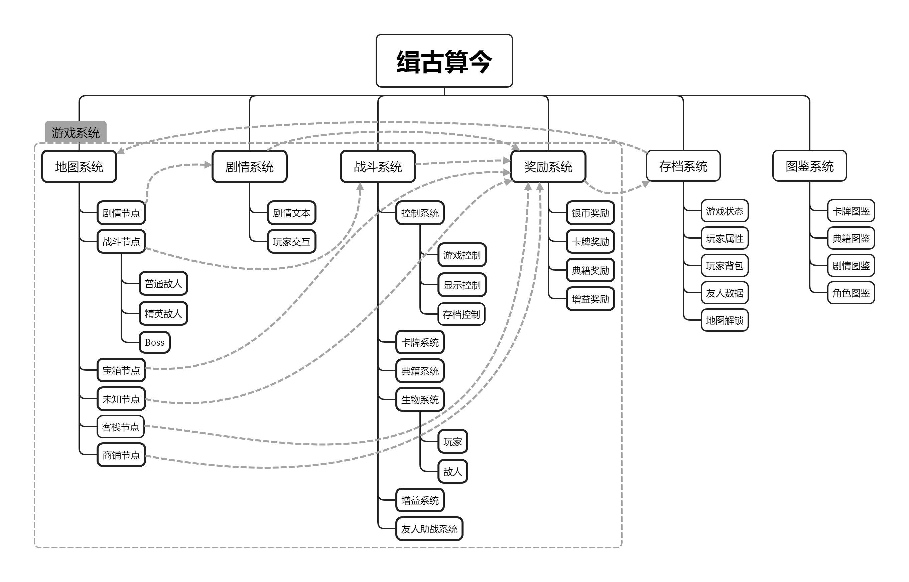

图中黑色实线代表的是作品各个系统功能之间的从属关系；灰色虚线箭头代表的是游戏数据在各个系统功能之间的流向。每个主要系统实现的功能概述如下：

- 地图系统：串联起游戏各个系统的重要组成部分；
- 剧情系统：总计包含51段剧情（总时长约2-3小时），在推进主线剧情的同时向玩家传授各种与中国古代数学相关的知识，并且设置了可交互部分，以达到寓教于乐的效果；
- 战斗系统：和主线剧情相关联，使用代表数学知识的卡牌战胜敌人，赢取丰厚的奖励；
- 奖励系统：结算游戏中获得各种属性增益或者资源奖励；
- 存档系统：存储游戏状态到本地，以备之后再次读取调用；
- 图鉴系统：可以查询与游戏相关的各项信息，同时也包含了一些关于中国古代数学知识的介绍；

#### 2.1.2 功能说明与游戏机制

由于图鉴系统主要起到查询游戏相关信息的功能，因此将穿插在其他系统功能说明中一并介绍，不再作单独说明；存档系统并非玩家可以直接交互的功能，因此在此章节也暂不展开介绍。

##### 地图系统

本作品尽可能按照肉鸽类（Roguelike）游戏的设计模式进行设计，因此地图系统具有生成随机性、进程单向性、不可挽回性、游戏非线性等特点。玩家能够交互的地图界面如下图所示：

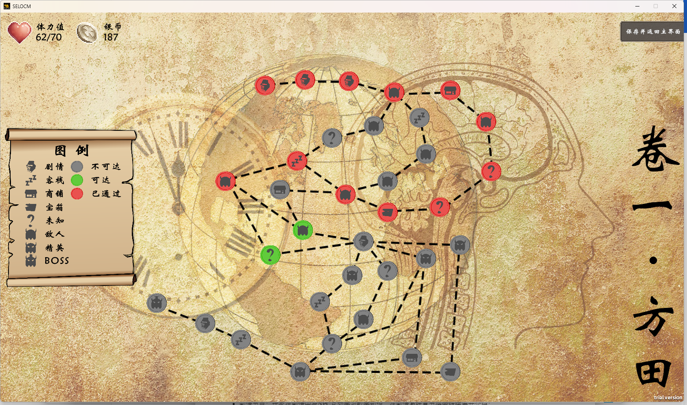

整张地图之间的路径均单向连接。玩家可以在一些节点自由选择进入哪条分支，但是不能走回头路。在地图中玩家已经通过的节点会被标记为红色，当前可以到达的节点标记为绿色，剩余不能到达的节点标记为灰色。一旦玩家在探险过程中死亡（体力值为0），只能从头开始探险。地图中可供玩家选择的地图节点类型说明如下：

- 剧情节点：玩家在剧情中与NPC互动学习数学知识，在剧情系统章节将会继续展开介绍；
- 战斗节点（包含敌人、精英、Boss）：玩家与遭遇到的各种敌人进行战斗并且获得奖励，在战斗系统章节将会继续展开介绍；
- 客栈节点：玩家可以在这里进入客栈，选择回复在战斗中失去的体力值、升级卡牌、获得银币或典籍、获得属性提升等效果；
- 商铺节点：玩家可以在这里使用获得的银币购买卡牌和典籍（有关典籍将会在典籍系统章节介绍），也可以在商铺用银币回收不需要的卡牌；
- 宝箱节点：玩家可以直接从宝箱节点获取银币和典籍奖励；
- 未知节点：玩家将会在这些节点遇到一些中国古代数学的谜题。如果回答正确，将会获得一种随机的正面增益；如果回答错误，同样会随机获得一种负面效果；

##### 剧情系统

玩家在剧情中与九章世界的原住民相识、互动、答题。不断学习和精进数学知识，解锁新的卡牌加入到卡池，并且获得各种奖励。玩家将会在剧情中逐渐结识九位原住民友人，她们将会在战斗中提供强大的助战效果。以下是玩家可以交互的剧情运行界面，包含了正常的文本对话模式和答题交互模式：

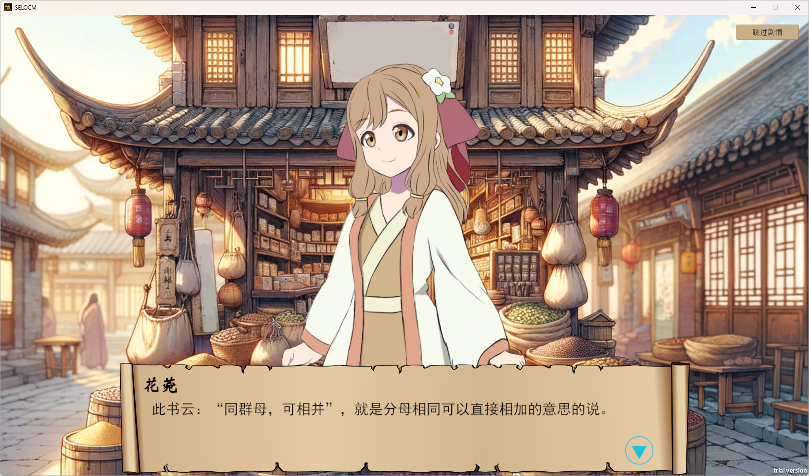

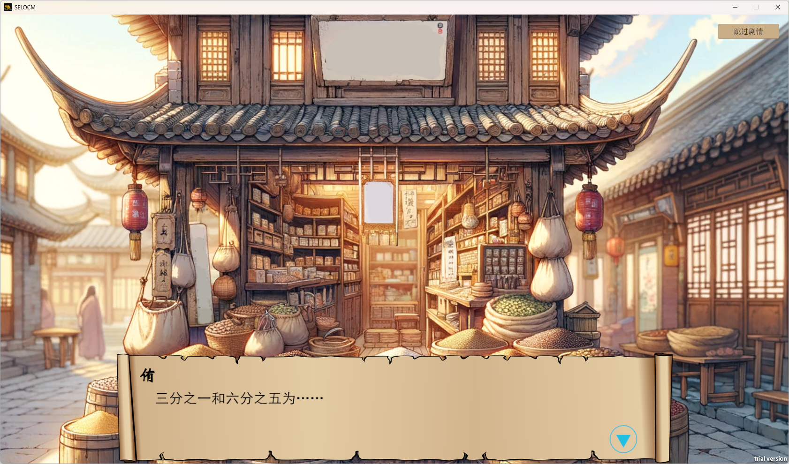

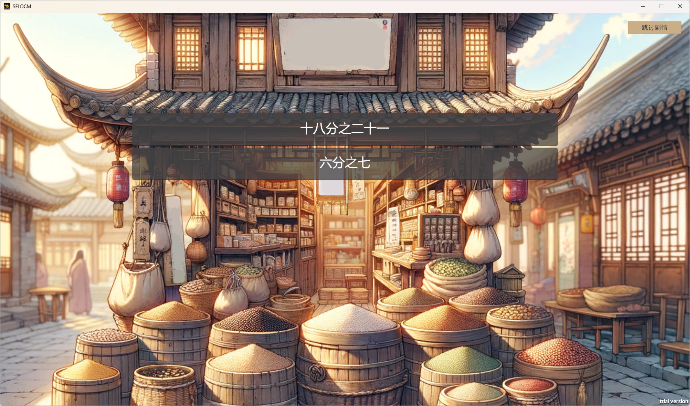

##### 战斗系统

在具体介绍战斗系统的功能及交互流程之前，需要先介绍其中几个重要的组成子系统：

**卡牌系统**

在游戏中，玩家获得的魔法能力以卡牌的形式体现。卡牌通过在剧情中与NPC互动学习数学知识被解锁并加入到卡池中，每当玩家获得卡牌奖励时，将会从卡牌池中随机选出默认三张不同卡牌供玩家选择一张加入到牌库中。卡牌可以用于在九章世界中和各类敌人进行战斗。卡牌奖励通常会在每场战斗结束后获得，剧情中也有可能会获得卡牌奖励。游戏中实装的不同卡牌数量为89张。

每一张卡面分别由以下几个部分组成（可参考示意图）：

- 卡牌名称：一张卡牌的标识名称，和中国古代数学相关。
- 卡牌效果：这张牌在战斗时被打出时的效果。在探险过程中玩家可以升级卡牌，从而获得更加强大的效果。
- 卡牌消耗：在战斗中玩家打出手牌需要消耗算术值（会在后文再介绍）。有些卡牌可以通过升级降低所需要消耗的算术值。
- 卡牌原文：与这张卡牌相关的典籍原文。（在图鉴页面，单击卡面上的原文可以触发全屏预览，方便玩家在游戏之余可以了解到卡牌的出处）。
- 卡牌类型：目前阶段已经实装的卡牌类型有三种：攻击牌、锦囊牌、装备牌。攻击牌（红色卡面）主要用于对敌人造成伤害。锦囊牌（蓝色卡面）主要在战斗中实现诸如增加护盾、额外摸牌弃牌等操作。装备牌（绿色卡面）可以给予玩家一些永久的数值增益或者能力。


**典籍系统**

典籍是“九章”世界的文化瑰宝。每一本典籍都可以在探险和战斗中提供强大的增益效果。典籍的获得方式主要依靠地图中的宝箱节点来获得。在与敌人战斗结束后也有概率掉落典籍。在击败每一层的boss后必定掉落该层地图对应的九章算术残卷。集齐九章残卷后可以合成典籍九章算术。游戏中实装的不同典籍数量为35本。在图鉴页面，玩家还可以通过典籍简介学习到与这本典籍相关的背景知识。

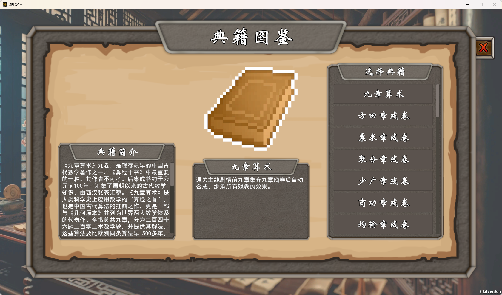

**战斗界面与流程**

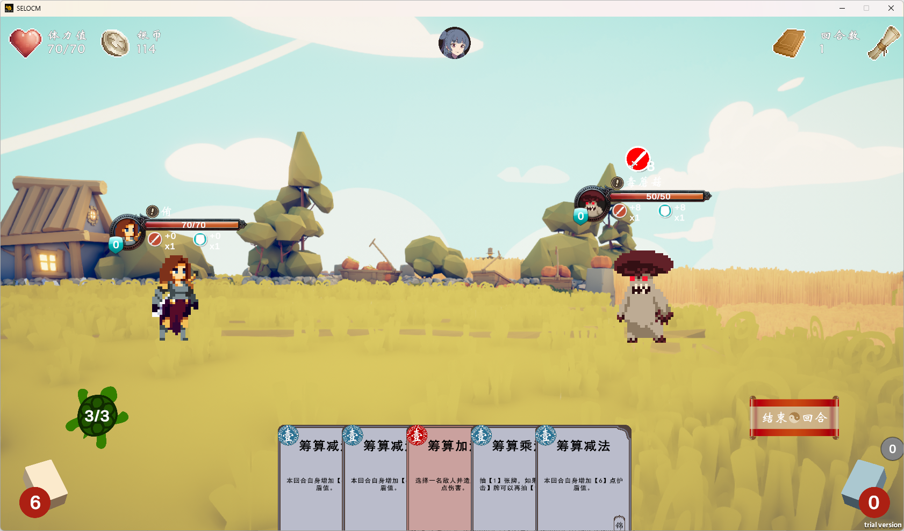

玩家在进入战斗节点后将会跳转到战斗界面。整个战斗界面如上图所示，界面上各个组成元素分别为：

- 顶部HUD：可以查看玩家当前的体力值、银币、获得的典籍、当前回合数等信息。也可以召唤友人进行助战（初始只有一名友人，随着主线剧情的推进会逐步解锁至9人，每使用1次友人助战，5次战斗后才能再次使用该友人进行助战）。友人助战的具体效果如下所示：

    | 角色名 | 助战技能                                                     |
    | ------ | ------------------------------------------------------------ |
    | 叶羽   | [占卜]获得1点算术值;抽3张牌.                                 |
    | 花菀   | [补给]立刻恢复25点体力值;获得5层[回复].                      |
    | 曜     | [捕捞]基础攻击力&防御力+2;对全体敌人造成3点伤害3次;获得3回合的3层[防御术]. |
    | 陆彼   | [精算]获得1点算术值;获得5回合1层[算术精进];基础攻击力+1.     |
    | 郭南   | [构筑]立刻获得30点护盾值;获得5层[坚壁清野].                  |
    | 戴雅   | [平乱]立刻对全体敌人造成20点伤害.随后对全体敌人造成5点伤害3次. |
    | 千歌   | [迎客]获得2点算术值.抽1张牌.获得3回合的5层[防御术].          |
    | 黎紫   | [开智]消除你身上所有的负面效果.基础防御力+2.                 |
    | 鞠笠   | [威势]获得1层[护甲].基础攻击力+1.                            |

- 玩家与敌人信息：可以查看玩家与敌人的名字、体力值（体力值上限）、护盾值、基础攻击（防御）力、攻击（防御）倍率、增益效果等信息。敌人信息还包括敌人每回合的行动意图及意图数值。

    - 玩家或敌人的体力值不能超过其体力值上限，当体力值为0时，判定其死亡。

    - 玩家可以通过卡牌、敌人可以通过意图为自身增加护盾值。在没有增益效果或典籍作用下，护盾值只在当前回合内有效。当玩家或敌人受到伤害时，优先扣除护盾值。护盾值为0时扣除其血量。护盾值没有上限。

    - 玩家的基础攻击（防御）力作为卡牌数值的额外加成，一局游戏开始时为0，在探险过程中可以通过奖励系统获得提升。具体的计算公式为：例如，一张卡牌的效果为【选择一名敌人并造成5点伤害】，在不考虑倍率影响的情况下，实际造成的伤害为5+玩家的基础攻击力点伤害。基础防御力也可以参照此模式计算。

    - 敌人的基础攻击（防御）力直接影响敌人攻击（防御）意图的意图值。会随着回合数的增长逐渐增长（受增长概率和增长速率两个参数值影响，可参考3.4.2中有关敌人静态数据的说明），这意味着玩家一旦与敌人进入消耗战，击杀的难度会逐渐上升。

    - 玩家或攻击（防御）倍率由身上的增益效果计算而来。当玩家（敌人）进行攻击时，实际造成的伤害需要乘以自身攻击倍率；当玩家（敌人）受到伤害时，实际受到的伤害需要乘以自身防御倍率。要想查看玩家（敌人）具体有哪些增益效果以及增益效果的说明，需要点击显示名字前的小感叹号呼出面板来查看。具体的41种增益效果列表如下：

        | 增益名称       | 正面or负面效果 | 增益效果（X代表增益的层数）                                  |
        | -------------- | -------------- | ------------------------------------------------------------ |
        | 强化           | 正面           | X回合内攻击造成的伤害提升25%。                               |
        | 硬化           | 正面           | X回合内被攻击时受到的伤害减少25%。                           |
        | 乏力           | 负面           | X回合内攻击造成的伤害减少25%。                               |
        | 脆弱           | 负面           | X回合内受到的伤害增加25%。                                   |
        | 回复           | 正面           | X回合内每回合恢复最大体力值的5%。                            |
        | 中邪           | 负面           | X回合内每回合减少最大体力值的5%。                            |
        | 荆棘           | 正面           | X回合内每受到一次攻击，攻击来源受到20%的反弹伤害。           |
        | 消除防御术     | 负面           | X回合后【防御术】失效。                                      |
        | 坚壁清野       | 正面           | X回合内护盾值不会在回合开始时清空。                          |
        | 放下屠刀       | 负面           | X回合内不能打出攻击牌。                                      |
        | 有勇无谋       | 负面           | X回合内不能打出攻击牌以外的牌。                              |
        | 消除额外手牌   | 负面           | X回合后【额外手牌】失效                                      |
        | 消除减少手牌   | 正面           | X回合后【减少手牌】失效                                      |
        | 消除算术精进   | 负面           | X回合后【算术精进】失效。                                    |
        | 消除算术退化   | 正面           | X回合后【算术退化】失效                                      |
        | 同归于尽       | 正面           | X回合后自身死亡，对玩家造成其剩余体力值的伤害。              |
        | 蓄力           | 正面           | X回合内自身基础攻击力翻倍。                                  |
        | 未知           | 正面           | 玩家造成3倍的伤害，不会受到伤害，X回合后死亡。               |
        | 护甲           | 正面           | 抵挡接下来受到的X次伤害。                                    |
        | 暴动           | 正面           | 接下来的X次攻击造成的伤害增加50%。                           |
        | 闪避           | 正面           | 接下来的X次受到的伤害减少50%。                               |
        | 连击           | 正面           | 接下来打出的X张牌将会被打出两次。                            |
        | 免疫           | 正面           | 免疫受到一次负面效果的影响。                                 |
        | 防御术         | 正面           | 回合开始时增加X点护盾值。                                    |
        | 防御术(永久)   | 正面           | 回合开始时增加X点护盾值。不会被倒计时消除。                  |
        | 勾股           | 正面           | 每当玩家打出一张手牌，对所有敌人造成X点伤害。                |
        | 惩戒           | 正面           | 每当玩家打出一张手牌，对玩家造成X点伤害。                    |
        | 行窃           | 正面           | 每次攻击时，盗取玩家10*X银币。                               |
        | 额外手牌       | 正面           | 每回合多摸X张牌。                                            |
        | 减少手牌       | 负面           | 每回合少摸X张牌。                                            |
        | 算术精进       | 正面           | 每回合额外获得X点算术值。                                    |
        | 算术退化       | 负面           | 每回合少获得X点算术值。                                      |
        | 额外手牌(永久) | 正面           | 每回合多摸X张牌。不会被倒计时消除。                          |
        | 减少手牌(永久) | 负面           | 每回合少摸X张牌。不会被倒计时消除。                          |
        | 算术精进(永久) | 正面           | 每回合额外获得X点算术值。不会被倒计时消除。                  |
        | 算术退化(永久) | 负面           | 每回合少获得X点算术值。不会被倒计时消除。                    |
        | 珠算精进       | 正面           | 所有【珠算卡牌】提升X点效果值。                              |
        | 五谷丰登       | 正面           | 每回合开始时，随机添加X张【粟米】卡牌到手牌中。              |
        | 少广           | 正面           | 【开方术】【开圆术】的效果值为2 ^ X，【开立方术】【开立圆术】的效果值为3 ^ X。 |
        | 盈余           | 正面           | 离开【盈余】状态时，获得2点算术值。                          |
        | 不足           | 正面           | 玩家造成的伤害和受到的伤害都翻倍。                           |

    - 敌人每回合的行动意图包括：攻击（对玩家造成1 * 基础攻击力的伤害1次）、连击（对玩家造成0.25 * 基础攻击力若干次）、重击（对玩家造成1.5 * 基础攻击力的伤害1次）、防御（产生基础防御力的护盾值）、回复（回复基础防御力的体力值）、给予自身正面增益、给予玩家负面增益、攻击的同时组合另一种非攻击意图。不同的敌人其行动意图的权重分布会有所不同，给予自身或玩家的增益效果也会不同。

- 算术值（左下角绿色龟壳上的左值）与初始算术值（右值）：玩家打出手牌需要消耗一定的算术值。在没有典籍加持下，每回合开始时玩家的算术值均为初始算术值。一局游戏开始时初始算术值默认为3，部分典籍获得后可以提升玩家的初始算术值。在战斗中个别卡牌也有使得玩家获得算术值的效果。

- 摸牌堆（左下角黄色牌堆）、手牌（下方正中间）、弃牌堆（右下角蓝色牌堆）、消耗牌堆（右下角灰色数字中）：不同功能的牌堆。手牌堆直接显示并且可以打出，其他牌堆可以单击数字唤起全屏查看界面。打出手牌的方法为拖动想要打出的手牌将其拖离手牌堆，待手牌显示UI变小后代表其已进入判定区域。此时松开鼠标，如果卡牌满足可以被打出的条件则会被自动打出。回合内玩家主动弃牌的操作亦与此流程类似。有关卡牌的具体游戏流程将在后文介绍。

- 回合结束按钮（右下角卷轴）：点击可以结束当前回合玩家操作的阶段。

战斗采用回合制，一个回合分为准备阶段-摸牌阶段-玩家阶段-弃牌阶段-敌人阶段-结束阶段共六个阶段：

- 准备阶段：玩家的算术值回复为初始算术值。敌人生成本回合的行动意图并展示在敌人的血条上方。玩家或敌人身上随回合变化的增益效果层数自减1，重新计算自身增益效果。
- 摸牌阶段：从玩家的摸牌堆默认摸出5张牌加入到手牌中。
- 玩家阶段：玩家消耗算术值打出手牌堆中的手牌来造成各种战斗效果，打出的手牌会被移入到弃牌堆中（装备牌和个别有特殊说明的其他手牌移入到消耗牌堆中）。当玩家认为是时候结束回合时，可以点右下角的按键结束回合。由于每次摸牌时摸牌堆剩余卡牌数量不足时会自动将弃牌堆洗牌后重新放入摸牌堆。因此被移入消耗牌堆的卡牌不能在战斗中再被打出。
- 弃牌阶段：玩家剩余的手牌全部移入弃牌堆（个别有特殊说明的手牌移入到消耗堆中）。敌人失去之前获得的剩余护盾。
- 敌人阶段：敌人根据在准备阶段产生的意图进行行动。
- 结束阶段：清空玩家在本回合中的护盾，进入到下一回合。

当存活敌人数量为0时，战斗胜利，进入奖励页面；玩家体力值归零时，游戏失败。

##### 奖励系统

由于玩家在交互层面无法直接接触到底层的存档系统，于是作为玩家与底层数据之间的桥梁——奖励系统应运而生。奖励系统是与存档系统联系最为紧密的系统，负责收集并计算玩家在游戏过程中获得的各种奖励资源数据，并将其写入到游戏存档中。在不同情形下，玩家可以通过不同的方式与奖励系统交互：

**奖励页面**

奖励页面出现在每一次剧情和战斗的结束之后，地图上的宝箱节点也会触发奖励页面。奖励页面可以给予玩家银币奖励、若干次卡牌奖励、以及一定概率的典籍奖励。银币和卡牌奖励的数量随着战斗难度和剧情内容的不同而变化；在宝箱节点中没有卡牌奖励，但是一定能获得一本典籍。每一次卡牌奖励玩家可以从三张随机不同卡牌中选择一张加入到自己的牌组中。奖励页面的界面UI图如下所示：

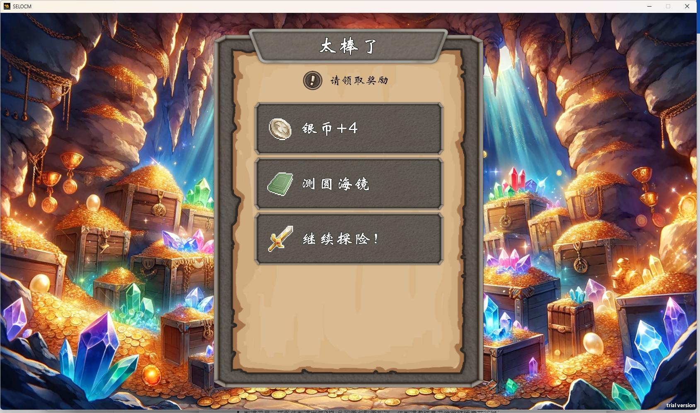

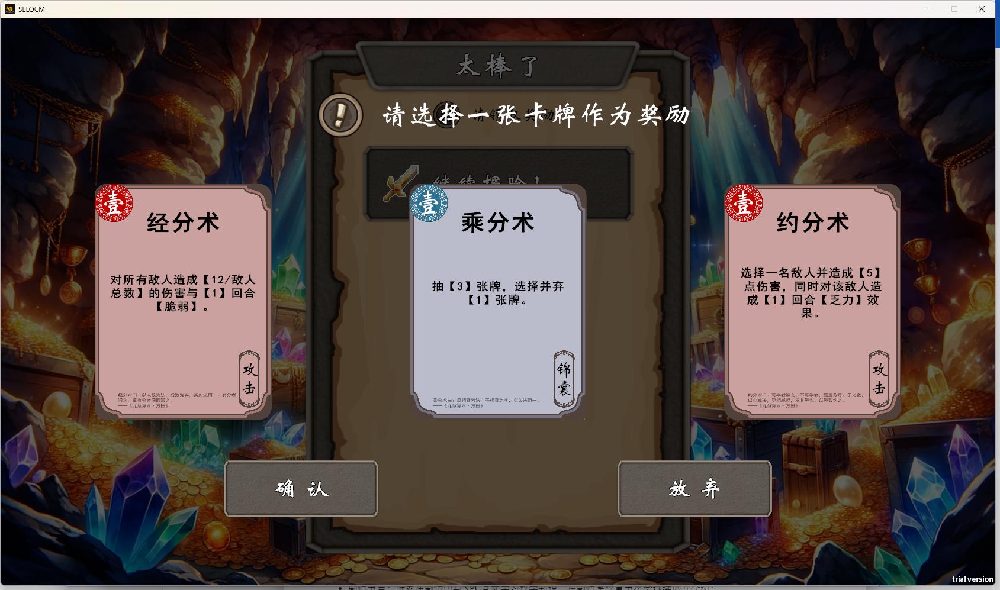

**答题页面**

当玩家进入地图上的未知节点时会触发此一交互界面。玩家需要回答一道与中国古代数学相关的谜题，并且根据答案的正确与否，将奖励或者惩罚写入到存档数据中。答题页面的界面UI图如下所示：

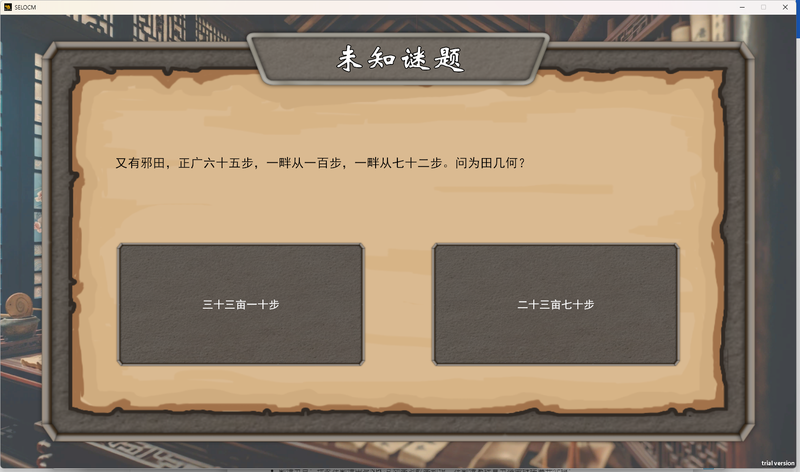

答题页面提供的奖励（惩罚）包括：

- 如果回答正确：30%的概率回复1-20之间的体力值；30%的概率获得1-33之间的银币；20%的概率基础攻击力提升1-5；20%的概率基础防御力提升1-5.
- 如果回答错误：30%的概率扣除1到10之间的体力值；30%的概率损失1到33之间的银币；20%的概率基础攻击力扣除1-2；20%的概率基础防御力扣除1-2.

**客栈页面**

当玩家进入地图上的客栈节点时会触发此一交互界面，玩家可以自由选择一间进入的房间，并且获得对应的奖励。客栈页面的界面UI图如下所示：

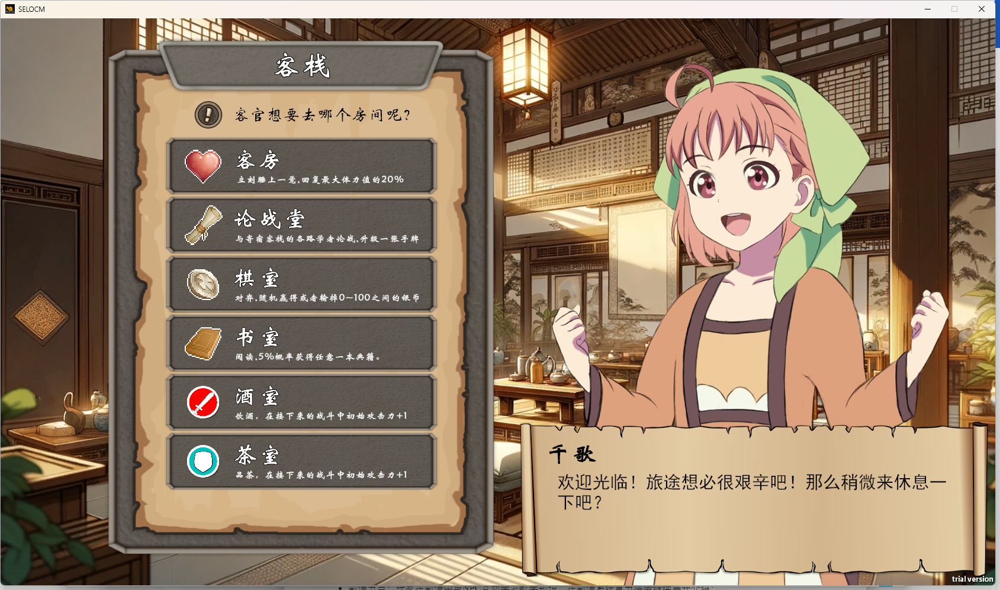

客栈页面提供的奖励包括：

- 回复体力值上限的20%。
- 选择并升级一张卡牌（仅在有卡牌未升级时可用）。
- 随机获得或损失0-100之间的银币。
- 5%的概率随机获得一本典籍。
- 提升1点基础攻击（防御）力。

**商铺页面**

当玩家进入到地图上的商铺节点时会触发此一交互页面。玩家可以通过使用在其他奖励页面获得的银币奖励与商人进行交易，来获得新的卡牌、典籍，或者是回收已经不需要的卡牌。商店页面的界面UI如下图所示：


商品价格的计算规则为：普通卡牌50-100之间的随机数；稀有卡牌100-200之间的随机数；史诗卡牌200-300之间的随机数；典籍抽选固定200；回收卡牌固定50。所有商品均有10%的概率获得半价折扣。商店中出现的卡牌只能是玩家通过剧情已经解锁的卡牌。

### 2.2 软硬件运行平台

成品最后的编译生成版本为exe文件，仅支持Windows操作系统使用。根据Unity官方文档，使用Version2022.3编译的桌面端软硬件运行平台需求如下：

| 操作系统     | Windows                                       |
| ------------ | --------------------------------------------- |
| 操作系统版本 | Windows 7 (SP1+)， Windows 10 and Windows 11  |
| CPU          | x86、x64 架构（支持 SSE2 指令集）。           |
| 图形API      | 兼容 DX10、DX11、DX12。                       |
| 其他要求     | Hardware vendor officially supported drivers. |

额外说明的是，建议使用16:9比例的显示器运行作品，否则在全屏模式下可能会出现画面显示不全的问题（窗口模式则不受影响）。

### 2.3 系统开发平台

#### 2.3.1 素材创作

本作品中主要由作者创作的素材为图片素材。按照创作途径可以如下划分：

- 自主手绘设计：使用Adobe Photoshop CC 2021与Procreate；
- AI辅助生成：使用OpenAI ChatGPT 4.0 & DALL-E 3；

#### 2.3.2 交互与代码设计

本作品在设计中使用的游戏引擎为Unity，版本号为：

- Unity Hub V3.3.1-c7；
- Unity Editor Version2022.3.15f1c1；

本作品在设计中使用的代码编辑器/集成开发环境包括：

- Microsoft Visual Studio Code 1.87.0；
- Microsoft Visual Studio 2022 Community 17.9.0；

本作品在设计中使用的版本控制工具为：

- 本地：git version 2.42.0；
- 远程：Github 私有仓库；

#### 2.3.3 开源平台及第三方工具

本作品中主要使用的开源平台及第三方工具均为Unity插件/第三方库，来源为Github或Unity官方插件商铺，均为免费资源。具体如下：

- [Demigiant/dotween(github.com)](https://github.com/Demigiant/dotween)：界面动画视效插件；
- [snozbot/fungus(github.com)](https://github.com/snozbot/fungus)：剧情交互插件；
- [Warrior Free Asset | 2D 角色 | Unity Asset Store](https://assetstore.unity.com/packages/2d/characters/warrior-free-asset-195707)：战斗界面的玩家模型；
- [Monsters_Creatures_Fantasy | 2D 角色 | Unity Asset Store](https://assetstore.unity.com/packages/2d/characters/monsters-creatures-fantasy-167949)：战斗界面的敌人模型；
- [Fantasy Wooden GUI : Free | 2D GUI | Unity Asset Store](https://assetstore.unity.com/packages/2d/gui/fantasy-wooden-gui-free-103811)：GUI界面素材；
- [Pixel Art Icon Pack - RPG | 2D 图标 | Unity Asset Store](https://assetstore.unity.com/packages/2d/gui/icons/pixel-art-icon-pack-rpg-158343)：GUI界面素材；

### 2.4 作品特色

本组成员在在进行项目的开发过程中着力解决了游戏类型确定、游戏剧情设计、程序系统与数据结构设计、艺术设计素材来源等问题，并最终都将它们转换为了作品的特色之一。

本作品与传统的游戏背景不同，结合当下高度发展的物理网、人工智能、元宇宙，构想未来发达的科技下诞生的九章世界。玩家既是现实世界的“玩家”，也是“缉古算今”中九章世界的玩家，具有更高的代入感和可玩性。与此同时本作品在开发过程中，不只着眼于该游戏的教育意义，我们同样注重其身为“游戏”的可玩性，所以我们决定将其开发为肉鸽类（Roguelike）剧情冒险向卡牌游戏。本作品主要的面向人群为青少年，考虑到越来越的学生共存的问题“数学难”“惧怕数学”等，所以我们推出了这款游戏，试图用寓教于乐的方法激发玩家们对于数学的热爱，通过中国古代数学知识的引入，增强青年的文化自信，进而不再畏惧数学。“缉古算今”的特色功能在于玩家有着极高的自由度，可以说从玩法到结局都由玩家来掌控，从而使得不同的玩家可以通过本作品得到不同的体会。

剧情方面我们参考了一些动漫作品、当下迅速发展的科技如物联网元宇宙等，以及小说中常用的写作手法，最终完成了“九章”的故事。整体内容包括一条明线与一条暗线，其中涉及到的每一层世界都对应《九章算术》的一章，均为独立的故事，最终九章串联组成一个完整的剧情，也只有玩家玩到最后一章才能发现明线下的暗线。全部剧情的打磨大约耗时一个月，由小组成员共同完成。对于《九章算术》在剧情中的应用，项目初期我们收集了九章算术的原文以及大量的相关解析和古籍，最终决定采用与NPC交互式对话和解决对应九章算术的数学问题的模式来融入中国古代数学，形成了目前本作品所呈现的形式。

考虑到为了能够在有限的时间内向作品中加入更多的策划内容，在程序系统与数据结构设计方面尽可能采用了模块化设计，最大化地增加了代码的可复用性。在初期阶段以整个游戏的第一章为基础蓝本，确定了各个系统架构的原型。在架构成型之后，只需要向静态数据表中补入策划数据，就可以快速完成剩余八章的游戏内容构建，从而在大大提升效率的同时又向玩家展示了足够多的游戏内容。

由于开发时间紧任务重，又需要保证艺术设计素材尽可能原创的情况下，我们的素材来源趋于多元化。较为重要的角色立绘素材通过作者手绘来完成；UI部分通过手绘设计，部分来源于网络素材；音效来源于网络素材；场景背景图则使用了时下热门的人工智能辅助生成绘图。多元化的素材来源使得艺术设计上的效率在保证质量的情况下大大提升，从而使我们能够有更多时间去打磨游戏的其他内容。

## 3 多媒体系统详细设计

### 3.1 构想与创意

本作品的构想是，在一个科技飞速发展的遥远未来，人类社会迎来了转抉性的变革。高级人工智能和机器人彻底接管了生产与服务行业，释放了人类从学习到工作的全部负担。人类的智慧被先进的自然语言模型所解放，进入了被称为“停滞纪元”的新时代。在这个时代，人类创造了史上最伟大的发明——“新世界”，这是一种结合了人工智能、物联网及元宇宙技术的虚拟现实设备。人们通过它进入一个庞大而细腻的虚拟世界，体验极致逼真的感官和情感。然而，这种依赖让人类渐渐丧失了思考能力。在这个由钢铁建筑覆盖、环境破坏严重的现世中，一切似乎都停滞了。为了唤醒人类沉睡的思维，“新世界”公司开创了一个古代中国数学挑战区——“九章”，希望人们通过游戏的形式重燃对数学的热爱，激活沉睡的智慧。

### 3.2 剧情与角色设计

#### 3.2.1 剧情设计

有关本作品的编剧方面，九章世界的故事分为明暗两条线，明线是主人公也就是各个玩家一层一层的冒险，每一层对应《九章算术》一个章节，有着独立的故事情节和《九章算术》所涉及到的数学知识点，主人公试图探寻九章世界的真正秘密并且回到现实世界；暗线则是主人公九层所经历的一切，不过是“九章”底层逻辑“生命”与“毁灭”的一个赌约，指向的是“生命”不满人类将原本学习数学知识的“九章”变为盈利工具，并且所有玩家也并没有真正的去学习数学、热爱数学，进而导致生命的扭曲，试图要将九章世界变为现实，彻底吞并人类。同时，结尾为开放性结局，旨在留给玩家更多的思考和想象空间。

#### 3.2.2 角色设计

本作品中所涉及到的人物除主人公外分为两种，一种为Boss，一种为友人。友人负责指引玩家学习每一层对应的《九章算术》中的数学知识，并且推动故事情节的发展，构建玩家与九章世界的情感羁绊。而Boss的设计也分为两种，“七宗罪”和生命毁灭。其中生命和毁灭同为九章世界底层逻辑的人格具象，而七宗罪则是生命扭曲了七位玩家内心的黑暗面所产生，用于完成其与毁灭之间的赌约。值得注意的是，每一位角色都有着饱满丰富的形象，和自身独特的性格，并不是扁平人物的单纯的“好”或者单纯的“坏”。

游戏中出现的所有角色以及形象设定如下表所示：

| 角色名 | 形象设定                                                     |
| ------ | ------------------------------------------------------------ |
| 叶羽   | 在“九章”经营万事屋（占卜店）的少女。性格固执，性情古怪，但心地很善良，不太会拒绝他人的请求。 |
| 花菀   | 叶羽的儿时玩伴。喜欢好吃的东西，靠售卖粮食营生。             |
| 曜     | 在“九章”从事捕鱼的少女。总是很开朗、精力充沛，运动神经拔群。 |
| 陆彼   | 戴雅的妹妹，在官府担任书吏。有些内向。                       |
| 郭南   | “九章”的著名工匠。很多宏伟的大工程均出自她的手笔。           |
| 戴雅   | “九章”的地方官员。聪明美丽，绝不允许歪风邪气的完美主义者。   |
| 千歌   | “九章”历史悠久的客栈的老板娘三姐妹中的老幺。不怕生，讨厌失败。 |
| 黎紫   | 孜孜求学的学者。性格平和，但充满好奇心，有着自命不凡的一面。 |
| 鞠笠   | 岛上城堡里居住的领主末裔。不怎么在人前展露身姿。             |
| 傲慢   | 被生命放大内心缺点＂傲慢＂ 的玩家，极为的心高气傲，看不上叶羽的占卜之术，进而被生命所利用来完成与毁灭的赌约。 |
| 暴食   | 原本为一名热爱美食的玩家，但因自身身材瘦弱，食量很小，进而产生了心理扭曲，被生命所利用化身为“暴食”。 |
| 嫉妒   | 一个能力普通的玩家，现实世界和游戏世界的生活都极其的平庸，所以十分嫉妒天资聪颖或者非常优秀的人，进而被生命所利用，化身为“嫉妒”。 |
| 懒惰   | 原本是一位大智若愚的玩家，表面很懒惰、非常懒散，其实是用最少的成本得到最大的利益，不去做无谓功。被生命强制放大懒惰的一面，化身为“懒惰”，后期摆脱了生命的控制，诞生自己的意识。 |
| 暴怒   | 一个武痴玩家，性格刚正但急躁，被毁灭所不喜，被生命扭曲为暴怒，后与懒惰一样恢复自己的意志。 |
| 贪婪   | 一名贪婪成性的玩家，被生命放大内心的贪欲化身“贪婪”，后作为祭司控制戴家。 |
| 色欲   | 一名极端的女权主义者，极为美丽，喜爱运用自己的美貌坑骗男性玩家，被生命控制化身“色欲”，将盈不足世界变为女权社会。 |
| 毁灭   | 与生命同为九章世界底层逻辑人格，代表的是暴虐毁灭的一面，想要彻底毁灭人类，由人工智能控制地球，因意见与生命不合与其进行了赌约。 |
| 生命   | 九章世界底层逻辑的主人格，试图将九章世界由虚拟变为现实，原本企图唤醒人们对数学的喜爱，激活人们的思考能力，但后来对人类失望进而试图“净化”人类，九章世界爆炸后不知下落…… |

### 3.3 艺术设计

本作品在艺术设计方面试图展现独特的创意和较为出色的技术运用。游戏的整体画风为中国古代风格，这种风格的选择不仅符合游戏的主题和背景，也为玩家营造了一种古朴高雅的游戏氛围。在游戏中，玩家可以感受到浓郁的中国文化气息，仿佛置身于一个充满历史底蕴的古代世界。

除了部分UI设计来自Unity官方商店的免费素材，本作品中大部分的美术素材均为原创通过手绘与人工智能生成辅助绘图相结合的方式，既展现了高度的原创性，又融入了先进的技术手段，使得游戏美术配图既自然又流畅。手绘的细腻和独特性是任何技术都无法替代的。在游戏中，手绘的人物立绘无疑是一大亮点，每一个细节都经过精心描绘，无论是人物的表情、服饰还是动作，都栩栩如生，仿佛跃然纸上。这种细腻的手绘风格，不仅为游戏增添了独特的艺术气息，也为玩家带来了更加舒适的视觉感受。而人工智能生成辅助绘图技术的运用，则使得游戏在保持手绘风格的同时，又具备了更高的制作效率和更丰富的表现形式。各种风格的配图，使得游戏的整体视觉效果更加出色。

本作品的声效来源于网络素材，采取的是中西结合、古今结合的方式，根据不同内容进行针对性的配乐，因游戏自身的包容性，玩家在游玩中会感受到各国、各个时间音乐的交融，照应“缉古算今”的主题。

### 3.4 程序系统设计与编程

#### 3.4.1 功能模块设计

在多媒体系统整体设计章节提到本作品所实现的主要系统功能包括地图系统、剧情系统、战斗系统、奖励系统、存档系统和图鉴系统。接下来将逐个对系统的各个功能模块设计进行介绍：

##### 地图系统、剧情系统、奖励系统与存档系统

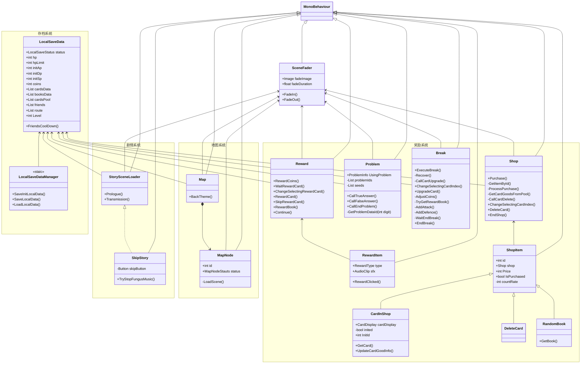

这四个系统之间的功能依赖关系较为紧密，因此绘制在同一张模块调用关系图中，如上图所示。（为了避免繁杂，只展示类型中一些主要的类型及方法。下同）下面是对这四个系统中模块的功能介绍：

- `MonoBehavior`：Unity脚本的共同父类。（下同，不再重复介绍）
- `SceneFader`：场景跳转模块。提供方法在加载场景时淡入；或跳转到目标场景时淡出。
- `LocalSaveData`：游戏存档的储存模块，包含了游戏过程中玩家的各项属性、背包资源、解锁地图等数据；同时包含了一些便于对存档数据进行读写操作的方法。大部分系统依赖于该模块来交换和暂存数据。具体封装的数据说明将会在数据结构设计部分再作介绍。
- `LocalSaveDataManager`：静态模块，提供方法从本地文件读取存档；或将存档保存为本地文件。
- `StorySceneLoader`：提供方法在剧情结束后跳转到下一个目标场景。
- `SkipStory`：提供方法直接快速跳过剧情。
- `Map`：构成地图系统的主要模块。本身具有与存档系统交互的功能，同时提供方法使玩家返回主界面。
- `MapNode`：与`Map`模块组合，记录每一个地图节点的相关数据，提供方法跳转到该节点对应的场景。
- `Reward`：实现在宝箱节点或剧情/战斗结束之后向玩家提供各种奖励功能的模块，本身具有与存档系统交互的功能。
- `RewardItem`：依赖于`Reward`模块，调用`Reward`中的对应方法向存档中写入奖励数据。
- `Problem`：提供方法实现地图中未知节点中答题功能的模块，本身具有与存档系统交互的功能。
- `Break`：提供方法实现地图中客栈节点的模块，本身具有与存档系统交互的功能。
- `Shop`：提供方法实现地图中商铺节点的模块，本身具有与存档系统交互的功能。
- `ShopItem`：依赖于`Shop`模块，调用`Shop`中的对应方法从存档中读取剩余银币进行交易，并将结果数据写入到存档中。
- `CardInShop`：继承自`ShopItem`，主要实现从商铺中购买卡牌的功能。
- `DeleteCard`：继承自`ShopItem`，主要实现从商铺中回收卡牌的功能。
- `RandomBook`：继承自`ShopItem`，主要实现从商铺中抽选典籍的功能。

##### 战斗系统


战斗系统的功能模块设计如上图所示，接下来对每个模块的功能进行介绍：

- `GameController`：整个战斗系统的核心控制模块，战斗系统中的基本所有模块都依赖于该模块运行。实现负责整场战斗中所有底层数据以及游戏进程的控制的功能。其封装的主要方法包括：

    - 播放音效。
    - 初始化敌人。
    - 摸牌、弃牌、攻击、防御、给予增益效果、调整攻击力等游戏控制功能。
    - 每一种卡牌打出后的具体效果方法（通常是上一条中几种方法的组合）。

- `DisplayController`：与`GameController`组合，实现负责控制整个战斗系统中的用户界面显示内容的功能。其主要封装的方法包括：

    - 在每一帧实时刷新用户页面上显示的各项数据。
    - 如果玩家和敌人的血量发生变化，提供平滑的过渡动画。
    - 弹出文字提示框。

- `SavesController`：与`GameController`组合，实现负责控制战斗系统与存档系统之间的数据交互的功能。其主要封装的方法包括从本地文件读取存档并协助`GameController`完成初始化；以及在战斗结束后重新结算玩家血量等数据存储回本地文件。

- `Creature`：玩家和敌人的共同基类，包括了一些共同的属性（如血量、攻击力、防御力等）和方法。

- `Enemy`：继承自`Creature`类的敌人模块，除了重载基类部分方法外主要增加了有关回合意图的控制功能。

- `Player`：继承自`Creature`类的玩家模块，除了重载基类部分方法外主要增加了有关玩家算术值和典籍的相关属性和方法。

- `BuffContainer`：与`Creature`组合，实现记录、计算玩家或敌人当前身上的正负增益效果并影响玩家或敌人的各项属性值的功能。

- `Buff`：由`BuffContainer`聚合，代表每一种正负增益效果的相关信息。`BuffContainer`根据一个列表属性中包含的所有Buff来计算最后的增益效果总和。

- `FriendItem`：实现友人助战功能的模块。具有属性记录每一位友人的ID与冷却状态来判断是否可用，如果可用则提供链接到`GameController`的方法来触发友人助战。

- `CardPile`：游戏中卡牌堆的共同基类，本身只继承了`Monobehavior`的Unity脚本方法，但与`CardList`模块组合实现了牌堆的各项功能。

- `CardList`：本身为卡牌列表的扩展模块，封装了一个卡牌列表和一些便于对齐进行读写操作的方法。

- `Card`：由`CardList`聚合，记录卡牌各项属性的模块，同时也封装了一些方法支持快速对卡牌信息进行更新操作。

- `DrawPile`：继承自`CardPile`模块，实现了摸牌堆的功能。其封装的独有方法包括：

    - 从`SavesController`读取存档数据并初始化牌组。
    - 洗牌（重置牌序，初始化后和弃牌堆卡牌返回摸牌堆时触发）。
    - 摸牌（从牌堆中弹出参数传入数量的卡牌列表并返回）。

- `DiscardPile`：继承自`CardPile`模块，实现了弃牌堆的功能。虽然名为弃牌堆，但是实际上同时管理着两个卡牌列表——弃牌堆和消耗牌堆。所以该模块封装了两组独立的方法以对两个牌堆进行读写控制。

- `HandCards`：继承自`CardPile`模块，实现了手牌堆的功能。其封装的独有方法大多是为了适配一些卡牌打出后对手牌牌组进行直接修改的情况，包括：

    - 立刻添加一个列表的额外卡牌到手牌堆中（主要是集成了刷新UI显示的方法，减少不必要的重复调用，下同）
    - 消耗手中所有卡牌类型不属于攻击牌的手牌

- `HandCardsUI`：由于手牌堆的UI显示机制较为复杂，于是将其独立于`DisplayController`之外单列控制。其封装的属性和方法包括：

    - 显示卡牌的宽度与间距。
    - 手牌UI拖动后触发判定是否可以被打出的屏幕范围。
    - 手牌堆中卡牌数量增减后平滑过渡的动画方法。
    - 刷新手牌堆中所有卡牌的显示信息，时刻保持与手牌堆数据情况一致的方法。

- `CardTemplate`：手牌堆中UI显示的卡牌模板，组合于`HandCardsUI`。手牌堆UI中所有显示的卡牌都由此模板复制而来。封装的类型记录了其原始的UI索引、绑定卡牌、位置缩放等信息；封装的方法实现了其可以被自由拖动并打出的功能，并将打出的信息广播给`GameController`进行调度。

- `BookViewer`：实现了支持玩家在战斗中查看已经获得的典籍及其效果的功能。

- `CardPileViewer`：实现了支持玩家在战斗中全屏预览摸牌堆、弃牌堆和消耗牌堆中卡牌内容功能。每个牌堆的UI绑定了一个不同的整型数作为参数传入，从而决定了在前台显示哪一个牌堆。

- `BuffInfo`：实现了支持玩家在战斗中查看自身或者敌人身上所有正负增益效果的功能。每个`Creature`的UI绑定了一个不同的整型数作为参数传入，从而决定了在前台显示玩家或是某一个具体敌人身上的正负增益效果。

- `BezierArrows`：针对某些卡牌打出后需要选中一个敌人触发效果，专门生成的视觉效果。当卡牌打出后直到选中敌人前，手牌堆UI到鼠标指针之间会出现一条由贝塞尔曲线计算的箭头。该模块主要实现这个视觉效果，如下所示：

    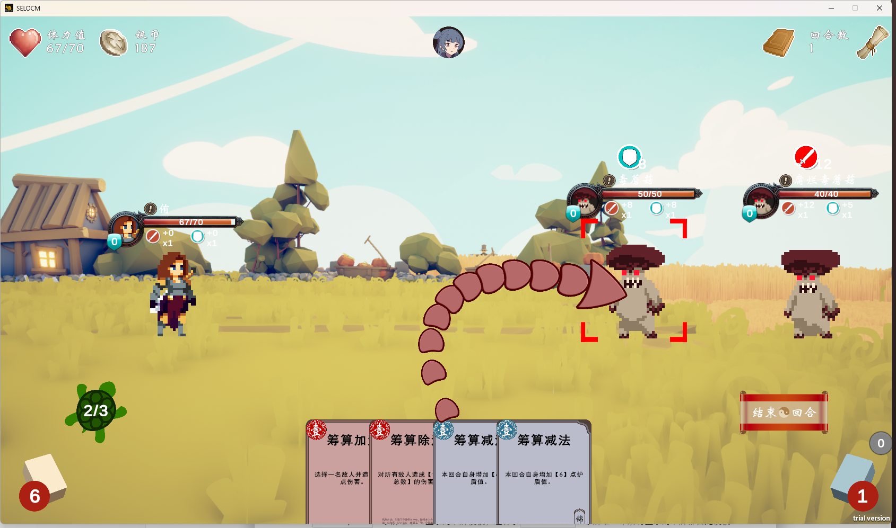

- `RoundButton`：绑定在回合结束按钮上，实现链接到GameController上触发结束玩家回合事件的方法。

##### 图鉴系统

由于游戏主界面与图鉴界面之间的相似共性较多，因此这两个界面场景同属于图鉴系统。


图鉴系统的模块设计如上图所示，接下来对每个模块的功能进行介绍：

- `MainTheme`：主要实现游戏主界面各项功能的模块。其封装的方法主要包括：
    - 弹出选择弹窗供玩家确认（是否通过已有存档继续游戏或开启新游戏；是否退出游戏）
    - 通过已有存档继续游戏、从初始存档开始新游戏。
    - 退出游戏。
    - 【静态方法】根据当前存档记录的最后一个地图节点位置判断下一个跳转的目标场景，整个项目都可调用该方法。
    - 【静态方法】更简单地播放音效，整个项目都可调用该方法。
- `ThemeButton`：与`MainTheme`组合，游戏主界面和图鉴界面共同使用的按钮模块，根据id属性的不同决定了其不同的点击后触发功能。
- `ThemePop`：与`MainTheme`组合，主要实现控制主界面的两种弹窗的功能。
- `Wiki`：主要实现图鉴页面各项功能的模块。因为共用了`ThemeButton`，因此与`MainTheme`组合发挥作用。
- `WikiScrollView`：实现图鉴中各个项目滚动选择列表的模板类，封装了初始化滚动选择列表的方法。继承该模块的子类则是分别为了适应不同的源数据类型（卡牌、典籍、角色、剧情）应运而生，因此不再作额外介绍。
- `CardDisplay`、`BookDisplay`、`CharacterDisplay`：分别实现图鉴页面显示卡牌、典籍、角色具体信息功能的模块。其封装了需要显示的信息属性以及更新当前显示内容的方法。
- `CardQuote`：主要实现卡牌图鉴页面卡牌原文单击能全屏预览的功能，其封装了文字组件的原始状态属性和一些平滑动画方法。

#### 3.4.2 数据结构设计

本作品中主要需要使用的数据类型可分为两种：静态数据和动态数据。

##### 静态数据

静态数据记录地图、卡牌、典籍等各项与游戏相关的数值数据。以csv表的形式封装在游戏资源文件（Resource/dataset）中，这些数据由一个对应的静态模块初始化为一个id为键数据模块为值的字典供系统在各处调用。这些数据在策划阶段由作者编辑，打包后这些数据不会再被修改。

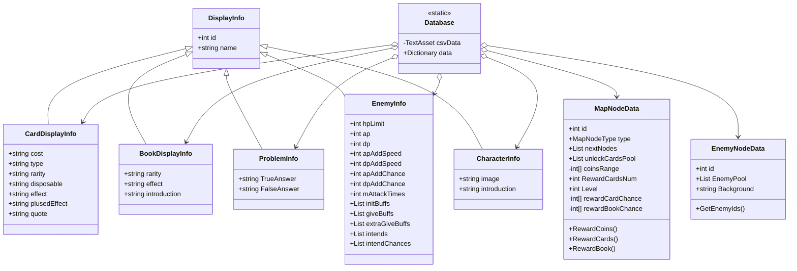

以上是负责实现静态数据读取与管理的模块示意图，其详细介绍如下：

- `DisplayInfo`：大部分静态数据模块的基类，因为他们共同拥有id和name这两个属性。
- `Database`：静态模块。（实际上由于静态类型不能继承，因此在具体程序中这一部分应当为`CardDatabase`、`BookDatabase`、`ProblemDatabase`、`EnemyDatabase`、`CharacterDatabase`、`MapDatabase`这些具体的静态模块，在图中为了方便演示将其抽象为同一模块）聚合其对应的静态数据模块发挥作用。在初始化时从指定的csv文件读取数据表并将其初始化为字典，随后程序可以直接通过该模块读取需要的数据。
- `CardDisplayInfo`：继承`DisplayInfo`，除了继承的属性之外还封装了卡牌消耗、类型、稀有度、可消耗性、效果、升级后效果、原文等显示信息。
- `BookDisplayInfo`：继承`DisplayInfo`，除了继承的属性之外还封装了典籍稀有度、效果、介绍等显示信息。
- `ProblemInfo`：继承`DisplayInfo`，除了继承的属性之外还封装了未知节点需要回答的问题的正确答案与错误答案。
- `EnemyInfo`：继承`DisplayInfo`，除了继承的属性之外还封装了：
    - 敌人的血量上限
    - 敌人基础攻击力（防御力）的值、每回合增长速率、每回合增长概率。
    - 敌人意图为连击时的多段攻击次数。
    - 敌人初始自身拥有或给予玩家的增益效果（根据是否为负面增益来区分给予对象）。
    - 敌人在回合行动意图中给予自身或玩家的增益效果（根据是否为负面增益来区分给予对象）。
    - 敌人的行动意图列表以及触发每种意图的概率。
- `CharacterInfo`：继承`DisplayInfo`，除了继承的属性之外还封装了角色的立绘路径与介绍。
- `MapNodeData`：专门实现地图节点信息功能的模块。其封装的主要属性和方法包括：
    - 基本信息：当前节点id、当前节点的次节点id；当前节点的类型、层数。
    - 奖励信息：解锁卡牌、银币奖励范围、卡牌奖励次数、卡牌分稀有度奖励概率、典籍分稀有度奖励概率。
    - 根据奖励信息结合随机数产生随机银币、卡牌、典籍奖励结果的方法。
- `EnemyNodeData`：专门实现战斗节点处理生成敌人的模块。其封装的主要属性和方法包括：
    - 节点id、当前战斗使用的场景背景路径。
    - 当前节点遇到的所有敌人池和从敌人池中随机返回一组敌人信息的方法。

##### 动态数据

动态数据：主要是游戏的存档数据，以json文件的形式保存在Application.persistentDataPath/users/localsave.json中。这些数据在游戏过程中会被频繁读写。需要使用时由存档系统读取为存档数据类型以供调用；使用结束后再由存档系统将其转换为json格式字符串并保存回本地文件。如前文所述，存档数据在游戏中的暂存模块为`LocalSaveData`，其封装的属性数据都是在整局游戏中玩家可以继承的数据，包括：

- 玩家当前体力值与体力值上限：每场战斗结束后或者在其他节点触发体力值变化后，检查体力值是否超过体力值上限或为0。如果超过体力值上限则将新体力值保存为体力值上限，为0则判定游戏失败，返回主界面，如果都不是则保存新体力值；当获得可以提升体力值上限的典籍时，保存新体力值上限。
- 玩家当前属性：在每场战斗开始时的初始基础攻击力、初始基础防御力与初始算术值。
- 玩家当前持有的资源：银币、牌组、典籍。
- 玩家当前解锁的卡牌池：随着剧情的推进会逐渐解锁新的卡牌到卡牌池中。卡牌奖励和商店中出现的卡牌只能是卡牌池中的卡牌。
- 玩家当前的友人助战可用情况：一个整型数列表。小于0代表该索引所代表的友人尚未解锁；等于0代表友人目前可用于助战；大于0代表需要等友人冷却后方能再次用于助战。战斗中每使用一次友人助战，该友人对应项自增5，代表需要5次战斗后的冷却才能再次可用；每一次战斗结束后，大于0的项都自减1，代表完成了1次冷却。
- 地图数据：玩家选择的地图路径。每当玩家进入一个地图上的节点，自动将该节点的id添加到路径列表中。通过查询该列表的最后一位，可以获得玩家当前所处的层数、位置等信息，从而进行一些依赖于玩家位置的方法操作。

## 4. 系统安装及使用说明

直接运行游戏根目录下的`SELOCM/SELOCM.exe`即可。随后具体的游戏操作可参考前文。

## 5. 总结

本作品结合了中国古代数学与现代科技的概念，旨在通过教育性游戏提高年轻一代对数学的兴趣和文化自信。游戏背景设定在一个科技高度发达的未来，通过虚拟现实和AI技术，复兴了古代数学的学习，同时游戏本身结合了闯关与卡牌游戏的元素，提高了玩家的参与感和挑战性。游戏的剧情和角色设计围绕《九章算术》的内容展开，通过一系列的故事和挑战，使玩家在娱乐的同时学习数学知识。基于对中国古代数学著作《九章世界》的学习与剖析，结合对当下人们过于依赖科技产品的社会现状的反思，积极响应国家关于弘扬中华优秀传统文化的号召，创作了一条古今相交的游戏故事主线；在原创学习剧情的同时，还设计了诸多极具热血冒险风格的游戏情节。

游戏的开发分为几个阶段，从游戏框架的确定、资料的准备、到具体的开发实施，每一阶段都精心设计以确保教育与娱乐的平衡。特别是在剧情和人物设计方面，团队借鉴了动漫和现代科技，使得故事情节和角色更具吸引力和深度。艺术设计方面，采用了手绘与AI生成辅助相结合的方式，既保持了视觉的原创性也提高了制作效率。在作品立意方面，考虑到越来越的学生共存的问题“数学难”“惧怕数学”等，所以我们推出了这款游戏，试图激发玩家们对于数学的热爱，通过中国古代数学知识的引入，增强青年的文化自信，进而不再畏惧数学。“缉古算今”的特色功能在于玩家有着极高的自由度，可以说从玩法到结局都由玩家来掌控，从而使得不同的玩家可以通过本作品得到不同的体会。我们围绕弘扬中国优秀传统文化、科学使用现代科技产品的主题展开项目，力求“寓教于乐”的功能效果。

本作品的主要可改进方向包括：

- 基于玩家反馈，对游戏界面和操作流程进行优化，减少可能的操作难度。编写一套完整、通俗、易懂的游戏教程并且内置于游戏中，降低新玩家的上手难度。
- 目前不能存储玩家既往的游戏记录。每次新开始游戏都会直接覆盖之前的游戏存档。考虑可以加入多存档以及保存游戏历史记录的功能。
- 进一步对游戏中的数值平衡（属性、概率、随机数算法等）进行优化，并且面向不同类型的玩家群体推出不同的难度梯度。例如：针对想要通过游戏学习中国古代数学知识的玩家，可以适当降低游戏的难度设计，减少中途玩家死亡的可能性，以便玩家可以完整的体验整局游戏的全流程；针对想要挑战自我的玩家，则可以将难度提升，创造更多的游戏性。
- 进一步对游戏剧情和其他内容如卡牌、典籍等进行扩充，增加游戏内容趣味性的同时进一步丰富游戏的教育意义。

不同的玩家在玩“缉古算今”的时候会有不同的体验，有的玩家更注重里面有趣的中国古代数学知识，有的玩家注重冒险的过程，也有的玩家沉浸于九章世界的瑰丽奇幻。不管玩家更痴迷于哪一种，我们都希望玩家们在沉浸的同时 可以抽身出来看到这款游戏的本质。中国古人的智慧是值得崇敬的，许多数学知识早在几百年前便领跑世界。所以在如今科技竞争，急需人才的时代，我们希望可以以一种创新的方式，为激发青年对数学的热爱贡献一份微薄的力量。看到古代数学的魅力，增强文化自信!

## 6. 附录

### 6.1 项目文件目录结构及说明

```
├─Assets（游戏资产文件）
│  ├─Cainos（第三方UI素材插件-Unity官方商店）
│  ├─DOTween（第三方动画效果插件-Github）
│  ├─Fantasy Wooden GUI Free（第三方UI素材插件- Unity官方商店）
│  ├─Fungus（第三方剧情插件-Github）
│  ├─Monsters Creatures Fantasy（第三方敌人素材插件-Unity官方商店）
│  ├─Resources（游戏资源文件）
│  │  ├─Animator（动画素材- Unity官方商店/原创编写）
│  │  ├─Audio（音频素材-网络）
│  │  ├─Background（场景背景素材-AI辅助生成创作）
│  │  ├─Character（角色立绘素材-原创绘制）
│  │  ├─Database（静态数据库-原创编写）
│  │  └─UI（用户界面素材-原创绘制）
│  ├─Scenes（场景文件-原创编写）
│  ├─Script（代码脚本文件-原创编写）
│  ├─Settings（设置文件）
│  ├─URP（URP文件）
│  └─Warrior free set（第三方玩家模型素材插件- Unity官方商店）
├─Library（Unity调用库）
├─Logs（日志文件）
├─obj（调试文件）
├─Packages（包配置文件）
├─ProjectSettings（项目设置文件）
├─Temp（临时文件）
└─UserSettings（用户设置文件）

```
### 6.2 静态数据库文件一览

| 文件名          | 说明         | 存储数据                                                     |
| --------------- | ------------ | ------------------------------------------------------------ |
| bookdb.csv      | 典籍数据     | id；典籍名；稀有度；效果；介绍                               |
| buffdb.csv      | 增益数据     | id；增益名称；增益效果；增益说明                             |
| carddb.csv      | 卡牌数据     | id；卡排名；消耗；类型；稀有度；（强化）效果；原文出处       |
| chardb.csv      | 角色数据     | id；名字；立绘路径；设定                                     |
| enemydb.csv     | 敌人数据     | id；敌人名称；体力值上限；基础攻击（防御）力数值；增长概率；增长速率；连击次数；初始增益；给予增益；回合行动意图权重 |
| enemynodedb.csv | 敌人节点数据 | id；敌人池规模；敌人池信息；战斗场景背景路径                 |
| mapdb.csv       | 地图数据     | id；类型；次节点；解锁卡池；奖励信息（数量、概率）           |
| problemdb.csv   | 问题数据     | id；原文问题；正确答案；错误答案                             |

### 6.3 参考资料

#### 6.3.1 中国古代数学典籍资料

- 原文：《九章算术》
- 原文：《隋书·律历志》
- 原文：《孙子算经·上卷》
- 原文：《梦溪笔谈·卷八》
- 原文：《辍耕录》
- 原文：《数术记遗》
- 维基百科：[算经十书(wikipedia.org)](https://zh.wikipedia.org/wiki/算经十书)
- 维基百科：[筹算(wikipedia.org)](https://zh.wikipedia.org/wiki/筹算)
- 维基百科：[珠算(wikipedia.org)](https://zh.wikipedia.org/wiki/珠算)

#### 6.3.2 开发资料

- Unity官方文档：[Unity User Manual 2022.3 (LTS) - Unity 手册](https://docs.unity.cn/cn/2022.3/Manual/UnityManual.html)
- 微软C#官方文档：[C# 指南 - .NET 托管语言 | Microsoft Learn](https://learn.microsoft.com/zh-cn/dotnet/csharp/)
- Fungus官方文档：[Fungus (fungusgames.com)](https://fungusgames.com/)
- DOTween官方文档：[DOTween (HOTween v2) (demigiant.com)](https://dotween.demigiant.com/)
